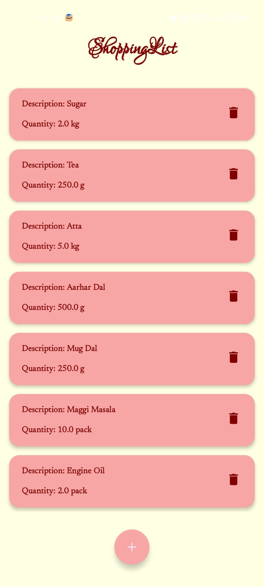

# 🛒 Shopping List App

A simple shopping list application built using **Kotlin** and **Jetpack Compose**, following **MVVM architecture** with **Room Database** for local data storage.

<p align="center">
  
  
</p>

---

## ✅ Features

- Add shopping items with **description**, **quantity**, and **unit**  
- View all shopping items in a **scrollable list (LazyColumn)**  
- Delete items from the list  
- Modern UI with **Material 3 components**  
- **MVVM pattern** for better scalability  
- **Room Database** for offline data persistence  

---

## 🛠 Tech Stack

- **Kotlin** – Programming Language  
- **Jetpack Compose** – UI Framework  
- **Room Database** – Local Storage  
- **Material 3** – UI Components  
- **MVVM Architecture** – ViewModel + Repository Pattern  

---

## 📦 Installation

1. **Clone the repository**  
   ```bash
   git clone https://github.com/your-username/shopping-list-app.git
   
---

## 📸 Screenshots
